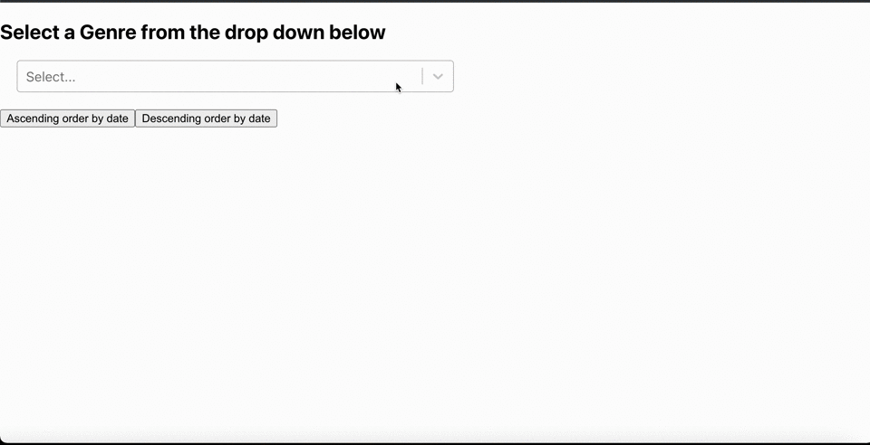

## Overview:

This is a take home assessment provided by Turing that I was given 8 hours to complete.  

## Example of Project:

## Tech used:
* React
* React Router
* JavaScript
* HTML
* CSS
* Cypress Testing
* Postman
* npm
* Webpack
* GitHub Issues
* GitHub Projects

## Setup

The details of this project are outlined in [this project spec](https://mod4.turing.edu/projects/take_home/take_home_fe).
This is the rubric for grading [rubric](https://mod4.turing.edu/projects/take_home/take_home_rubric).

**You will need an API key from the [NYT site](https://developer.nytimes.com/docs/top-stories-product/1/overview)

1. Fork this Repo
2. Clone it down to your machine
3. `cd` into the root of the project directory
4. Run `npm install`
5. Run `npm start`

For Cypress Testing:
1. Run `npm run cypress`
2. Follow the prompts in the browser and select the spec file you want to run

**Link to Cypress docs for trouble shooting [Cypress](https://docs.cypress.io/guides/getting-started/installing-cypress)

## Contributors:
- [Trish Fox-Collis](https://github.com/tfoxcollis)

## Contributor LinkedIn Profile
- [Trish Fox-Collis](https://www.linkedin.com/in/trish-fox-collis/)
